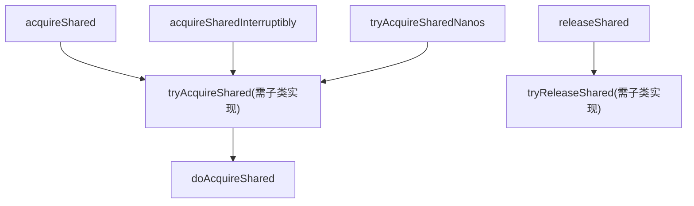
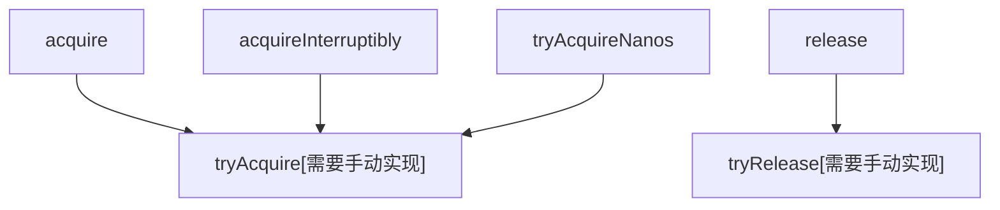

## Node节点状态(waitStatus)

* `signal`  值为-1,表示当前节点的后继节点处于等待状态,如果当前节点释放了同步状态或者取消,将会通知后继节点
* `cancelled` 值为1,表示当前线程被取消(等待超时或中断),该线程取消之前的是等待状态,且进入取消状态后就不再变化
* `condition` 值为-2,表示当前节点在等待condition,也就是在condition队列中,当其他线程对condition调用`signal()`方法后,该节点从等待队列转移到同步队列中
* `propagate` 值为-3,与共享模式相关,在共享模式中,该状态标示结点的线程处于可运行状态

## 共享模式



* 在`acquireShared`方法中,如果`tryAcquireShared`返回值小于0,表示获取资源失败,因为该`acquireShared`不接收中断信号,且没有超时时间,唯一做的是就是等待
* 因此会进入`doAcquireShared`方法,该方法做的事情:
  1. 创建一个Node节点 `waitStatus=0` `nextWaiter=SHARED`(表明该节点为共享节点)
  2. 将该节点添加到`CLH`队列的尾部(采用CAS,直到添加成功为止)
  3. 获取当前节点的`prev`节点,如果`prev`节点为头节点,则会尝试`tryAcquireShared`再次获取资源,如果成功则进入4,否则进入5
  4. 获取成功,将当前节点变为`head`节点(清空当前节点的信息),从队列尾部开始向前遍历,找到一个最接近队头并且状态是`signal` `condition` `propagate`之一的节点,并将其解除阻塞状态
  5. 获取失败,检查当前节点的前置节点`waitStatus`状态
     * `signal` 则线程可以安全的阻塞状态
     * `canceled` 则递归查找前置节点直到节点状态为`signal`
     * 其他 则将前置节点的状态直接改为`signal`

* 在`releaseShared`方法中,如果`tryReleaseShared`返回true(表示资源释放成功),则进入`doReleaseShared`方法:
  1. 获取`head`节点,如果该节点的`waitStatus=signal`,则尝试将其设置为0,如果也成功,则进入第二步,如果失败则重复该步骤,如果该节点的`waitStatus=0`则尝试将状态设置为`propagate`,如果成功则退出,如果失败,则重复该步骤
  2. 获取`head`节点的`next`节点,如果`next`节点不是`cancelled`或0,则解除其阻塞状态,否则,从尾部节点开始向前查找,直到找个一个最靠近`next`节点且`waitStatus != cancelled`的节点,如果存在则 解除其阻塞状态

## 独占模式



> 获取独占锁

```java
public final void acquire(int arg) {
  //tryAcuqire返回true表示锁获取成功,false获取失败
  //acquireQueued是自旋的过程
  //addWaiter在CLH队列中添加一个Node节点,且该节点为独占模式
  if (!tryAcquire(arg) &&
      acquireQueued(addWaiter(Node.EXCLUSIVE), arg))
    selfInterrupt();
}

final boolean acquireQueued(final Node node, int arg) {
        boolean failed = true;
        try {
            boolean interrupted = false;
            for (;;) {
                //当前节点的前置节点为首节点,尝试获取锁,如果获取成功,这将当前节点设置为头节点
                final Node p = node.predecessor();
                if (p == head && tryAcquire(arg)) {
                    setHead(node);
                    p.next = null; 
                    failed = false;
                    return interrupted;
                }
                //前置节点不是首节点或者获取锁失败
                if (shouldParkAfterFailedAcquire(p, node) &&
                    parkAndCheckInterrupt())
                    interrupted = true;
            }
        } finally {
            if (failed)
              //predecessor()方法抛异常时,才会执行该代码,否则永远不会执行到
                cancelAcquire(node);
        }
    }

private static boolean shouldParkAfterFailedAcquire(Node pred, Node node) {
        int ws = pred.waitStatus;
        if (ws == Node.SIGNAL){
           //如果前置节点waitStatus=signal则将当前线程阻塞
           return true;
        }
        if (ws > 0) {
           //如果前置节点状态为cancelled,则从尾节点向前查找,直到找到一个状态为signal,condition的节点
            do {
                node.prev = pred = pred.prev;
            } while (pred.waitStatus > 0);
            pred.next = node;
        } else { 
           // 如果前置节点状态是其他,则将前置节点状态变更为signal
            compareAndSetWaitStatus(pred, ws, Node.SIGNAL);
        }
        return false;
    }
```

```java
//带有超时时间来获取锁
public final boolean tryAcquireNanos(int arg, long nanosTimeout);
//在执行时间内没有获取到锁则返回false,该方法响应线程的中断状态
private boolean doAcquireNanos(int arg, long nanosTimeout)
            throws InterruptedException {
        if (nanosTimeout <= 0L)
            return false;
        final long deadline = System.nanoTime() + nanosTimeout;
        final Node node = addWaiter(Node.EXCLUSIVE);
        boolean failed = true;
        try {
            for (;;) {
                final Node p = node.predecessor();
                if (p == head && tryAcquire(arg)) {
                    setHead(node);
                    p.next = null; // help GC
                    failed = false;
                    return true;
                }
                nanosTimeout = deadline - System.nanoTime();
                if (nanosTimeout <= 0L)
                    return false;
                if (shouldParkAfterFailedAcquire(p, node) &&
                    //如果剩余超时时间小于1000纳秒则继续自旋,大于则进入有时间的阻塞
                    nanosTimeout > spinForTimeoutThreshold)
                    LockSupport.parkNanos(this, nanosTimeout);
                if (Thread.interrupted())
                    throw new InterruptedException();
            }
        } finally {
            if (failed)
                cancelAcquire(node);
        }
    }

```

> 释放独占锁

```java
public final boolean release(int arg) {
        if (tryRelease(arg)) {
            Node h = head;
            if (h != null && h.waitStatus != 0)
                //唤醒头节点的下个节点
                unparkSuccessor(h);
            return true;
        }
        return false;
    }

private void unparkSuccessor(Node node) {
        int ws = node.waitStatus;
        if (ws < 0)
            compareAndSetWaitStatus(node, ws, 0);
        Node s = node.next;
  			//next节点不存在或者已取消
        if (s == null || s.waitStatus > 0) {
            s = null;
            //从尾部向前遍历,找到一个离头结点最近的节点且状态是小于0的节点将其唤醒
            for (Node t = tail; t != null && t != node; t = t.prev)
                if (t.waitStatus <= 0)
                    s = t;
        }
        if (s != null)
            LockSupport.unpark(s.thread);
    }
```

