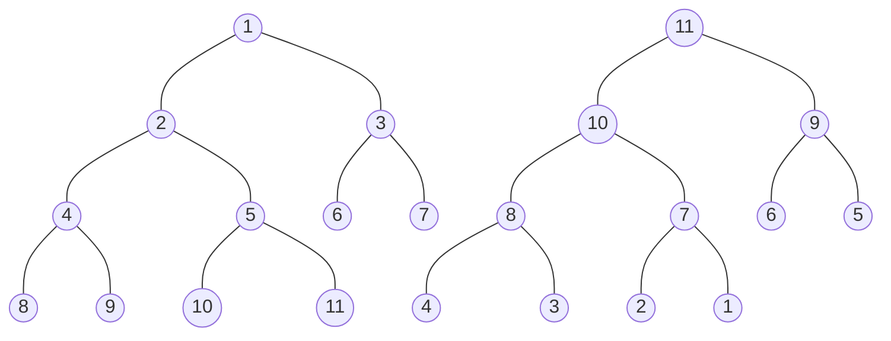

> `PriorityBlockingQueue` 是带有优先级FIFO队列 内部采用二叉堆实现

> 最小堆 = 父节点总是小于等于左右子节点
>
> 最大堆 = 父节点总是大于等于左右子节点
>
> 二叉堆一般用数组表示,如果父节点的节点位置在N,则左子节点=`2*n+1`,右子节点=`2(n+1)` 父节点=`(n-1)/2`

|  1   |  2   |  3   |  4   |  5   |  6   |  7   |  8   |  9   |  10  |  11  |
| :--: | :--: | :--: | :--: | :--: | :--: | :--: | :--: | :--: | :--: | :--: |
| n=0  | n=1  | n=2  | n=3  | n=4  | n=5  | n=6  | n=7  | n=8  | n=9  | n=10 |

#### 最小堆-添加元素(最大堆类似)

* 在数组尾部添加元素
* 与父节点比较(`(n-1)/2`得出父节点下标),如果小于父节点,则父子调换位置
* 继续与父节点进行比较

#### 最小堆-删除元素(最大堆类似)

* 删除元素(N),同时取出最后一个元素(M),尝试将插入到N的位置
* 将M与(N的左右子节点)进行比较,将两个节点中较小的节点调换位置
* 继续比较较小节点的两个子节点,直到符合最小堆或最大堆要求为止